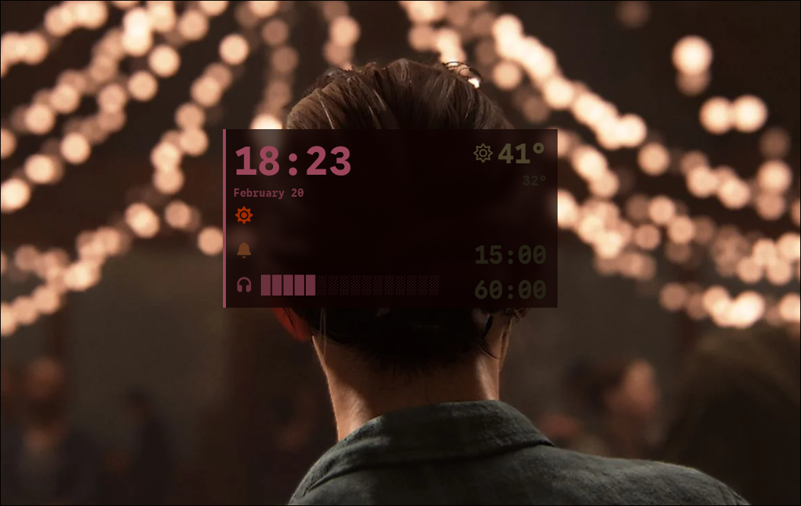

# widgets

Bespoke Wayland desktop widgets written from scratch in Rust against smithay-client-toolkit + tiny-skia. No widget frameworks.

## Widgets

### wavedash
Floating status overlay — clock, weather, pomodoro timers, volume control, theme toggle.



### wallrun
Image picker overlay — thumbnail grid, fuzzy search, keyboard + mouse nav.


### grimoire
App launcher / dmenu replacement — filterable list with icons, fuzzy search, frecency sorting.


## Stack

- smithay-client-toolkit 0.20 (Wayland layer-shell, input, SHM buffers, calloop)
- tiny-skia (CPU rendering)
- cosmic-text (text shaping/glyph rendering)
- walrs (colorscheme integration from wallpaper)

## Build

Cargo workspace with a unified Makefile:

```
make install          # build + install all widgets to ~/.local/bin/
make install W=wavedash  # build + install just one
```

## Config

- Config files: `~/.config/widgets/<name>.toml`
- State files: `~/.local/state/widgets/<name>/`
- Color templates: `~/.config/walrs/templates/`
