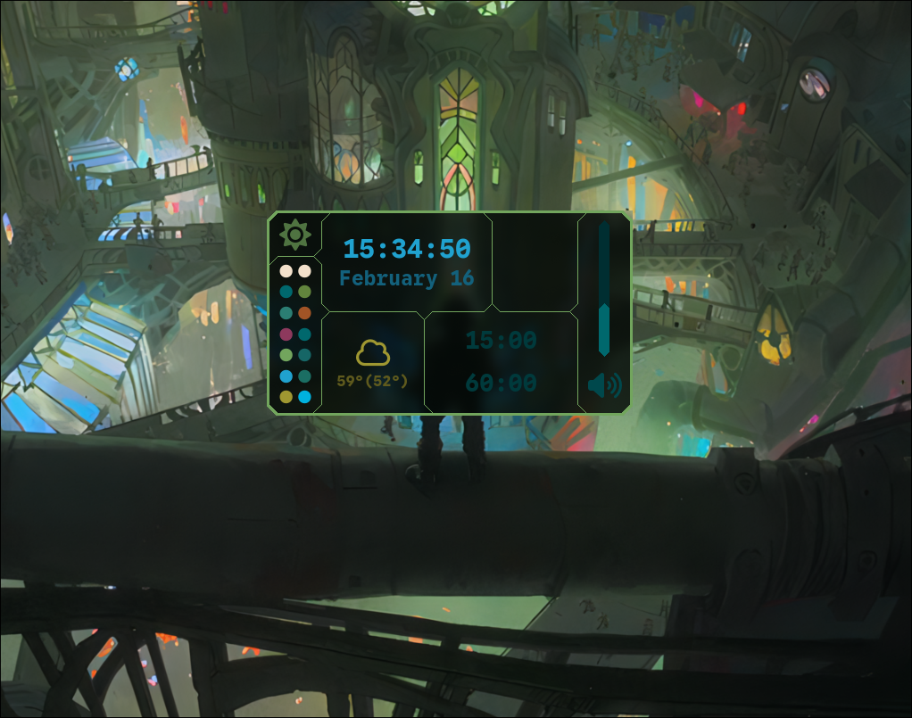
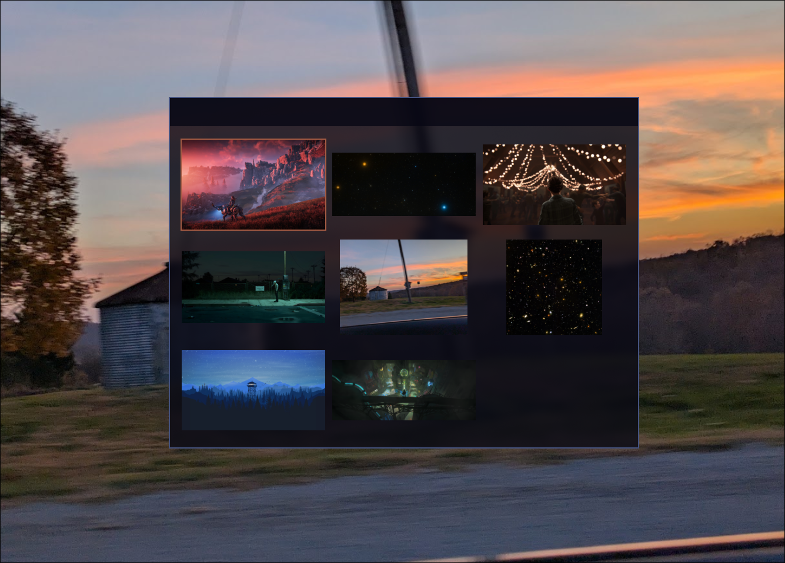
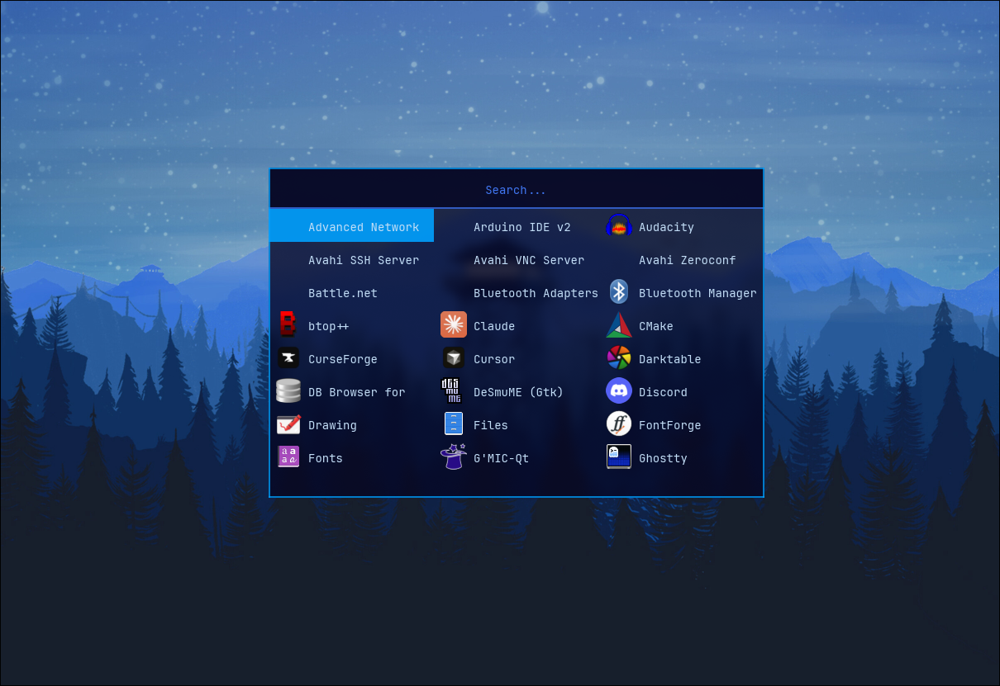

# widgets

Bespoke Wayland desktop widgets written from scratch in Rust against smithay-client-toolkit + tiny-skia. No widget frameworks.

## Widgets

### wavedash
Floating status overlay — clock, weather, pomodoro timers, volume control, theme toggle.



### wallrun
Image picker overlay — thumbnail grid, fuzzy search, keyboard + mouse nav.



### grimoire
App launcher / dmenu replacement — filterable list with icons, fuzzy search, frecency sorting.



## Stack

- smithay-client-toolkit 0.20 (Wayland layer-shell, input, SHM buffers, calloop)
- tiny-skia (CPU rendering)
- cosmic-text (text shaping/glyph rendering)
- walrs (colorscheme integration from wallpaper)

## Build

Cargo workspace with a unified Makefile:

```
make install          # build + install all widgets to ~/.local/bin/
make install W=wavedash  # build + install just one
```

## Config

- Config files: `~/.config/widgets/<name>.toml`
- State files: `~/.local/state/widgets/<name>/`
- Color templates: `~/.config/walrs/templates/`

All TOML keys are optional. Background opacity is **not** a TOML key — set `background_opacity = 0.0..1.0` in the widget's color file (generated from its walrs template).

### wavedash

| key | default |
| --- | --- |
| `color_file` | `~/.cache/wal/colors-wavedash.toml` |
| `font` | `~/.local/share/fonts/GoogleSansCode-Bold.ttf` |
| `icon_font` | `/usr/share/fonts/OTF/Font Awesome 7 Free-Solid-900.otf` |
| `font_size` | `39.0` |
| `timer1_duration` | `3600` |
| `timer2_duration` | `900` |
| `bt_device_1` | `AC:BF:71:08:A1:D6` |
| `bt_device_2` | `EC:81:93:AC:8B:60` |
| `weather_lat` | `0.0` |
| `weather_lon` | `0.0` |

### wallrun

| key | default |
| --- | --- |
| `color_file` | unset |
| `font` | `~/.local/share/fonts/GoogleSansCode-Regular.ttf` |
| `font_size` | `20.0` |
| `label_font_size` | `14.0` |
| `show_labels` | `true` |
| `columns` | `3` |
| `window_width` | `800` (or `"fit"`) |
| `window_height` | `600` (or `"fit"`) |

### grimoire

| key | default |
| --- | --- |
| `color_file` | unset |
| `font` | `~/.local/share/fonts/GoogleSansCode-Regular.ttf` |
| `font_size` | `18.0` |
| `comment_font_size` | `14.0` |
| `icon_size` | `32` |
| `window_width` | `600` |
| `window_height` | `400` |
| `terminal` | `ghostty -e` |
| `columns` | `1` |
| `show_comments` | `true` |
| `search_comments` | `false` |
| `center_items` | `false` |

### evoke

| key | default |
| --- | --- |
| `color_file` | `~/.cache/wal/colors-evoke.toml` |
| `model` | `medium.en` |
| `models_dir` | `~/.local/share/pywhispercpp/models` |
| `sounds` | `false` |
| `width` | `300` |
| `height` | `60` |
| `bar_count` | `48` |
| `bar_width` | `4` |
| `bar_gap` | `2` |
| `margin` | `0.25` |
| `scale` | `4.0` |
| `border_width` | `1` |
